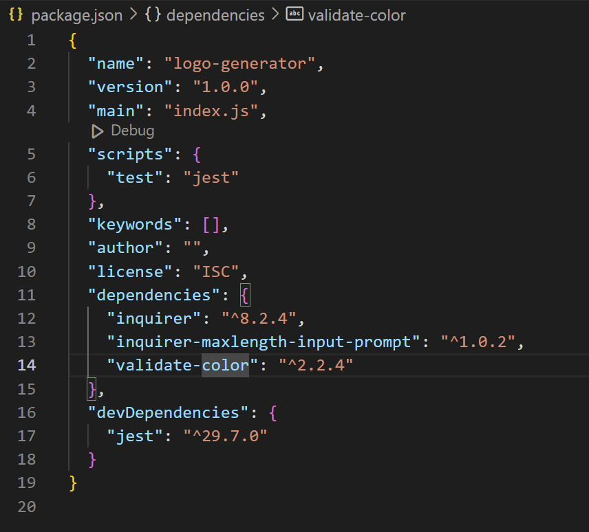
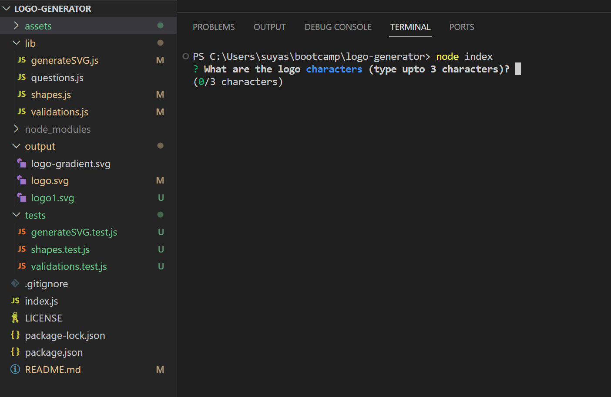
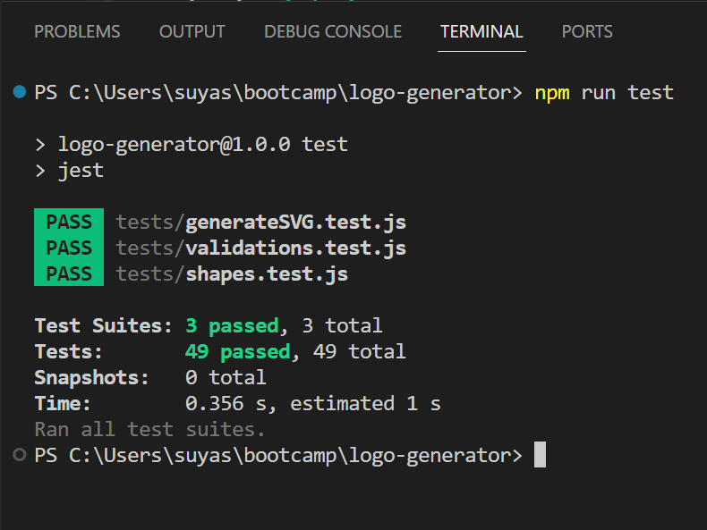
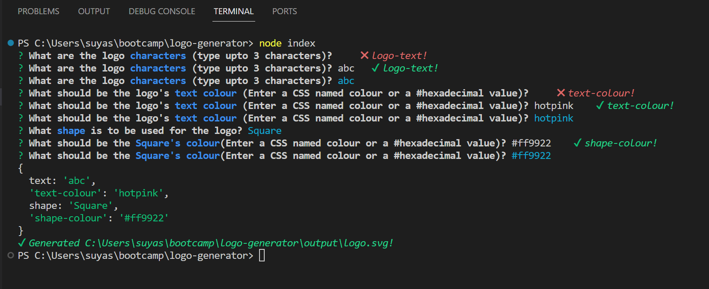
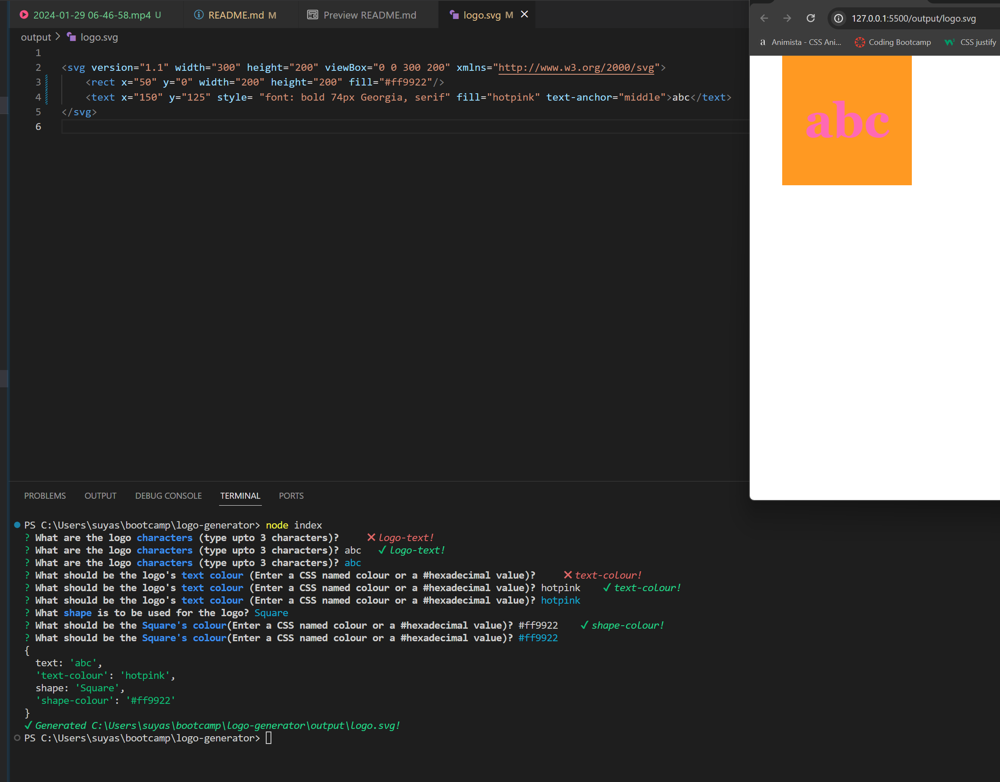

 [](https://nodejs.org/en) [](https://www.npmjs.com/) [](https://www.npmjs.com/package/inquirer) [](https://jestjs.io/)


<div align="right"> 
<a href= "http://www.wtfpl.net/about/"></a>
</div>

# Simple SVG Logo Generator    

This app creates a simple SVG logo consisting either a triangle or a square or a circle and some text on it.

##  Description
A Logo is an eye catching image that serves as a unique brand identifier of any organization. It can vary from simple to very complex design-wise, limited only by artistic capabilities. But for our usage in the github projects, this app creates a `simple logo` of `300px width` and `200px height`, featuring a shape of either a `Triangle`, or a `Square` or a `Circle` with a `text`, which is `upto 3 characters` long, on top. 

By creating this project, I learnt the `inquirer npm package`, and also learnt to install the `Node.js` and the `npm`, and build and use `modules` which enable us to separate logically distinct part of the script into different scripting files. I also learnt to use various included packages in `node_modules` such as `chalk`, `figures`, `log-symbols`.

I also learnt [`ANSI Escape Codes`](https://gist.github.com/fnky/458719343aabd01cfb17a3a4f7296797), which helps to change the style of console log text. A also learnt to use `valiate-color` to validate CSS defined colour values, `inquirer-maxlength-input-prompt` to validate input length and `jest` package for unit testing.

## Table of Contents

1. [Installation](#installation)
1. [Usage](#usage)
1. [Licence](#licence)
1. [Screenshots](#screenshots)
1. [Demo](#demo)


## Installation 

1. Download and Install the `Node.js` 
1. Install `NPM` by typing
    ```       
    npm init -y
    ```
1. Install `Inquirer`     
    ```         
    npm i inquirer@8.2.4
    ```
1. Install `Validate Color` Plugin
    ```
    npm i validate-color --save
    ```
1. Install `Inquirer Maxlength Input Prompt` Plugin
    ```
    npm i @matti-o7/inquirer-maxlength-input-prompt
    ```
1. Install `Jest`
    ```
    npm install --save-dev jest     or    npm i -D jest
    ```
After installation of all the required plugins and packages, change the `test` to `jest` and the `package.json` file should look like below:              


## Usage

- Open a new terminal in `Command Prompt` or `Git Bash` or `Visual Studio Code`
- Change directory to the parent folder of `index.js`
- Initiate the `Inquirer` by tying the following
    ```
    node index
    ``````
- Answer the prompts shown to generate the `logo.svg` file              
   

- To select an answer from a list, use ↑ and ↓ keys and press *Enter*
- Inititate the `Jest` unit testing by typing in the following
    ```
    npm run test
    ```             


## Licence

This app is licensed under [**WTFPL**](http://www.wtfpl.net/about/)

## Screenshots

Screenshot showing the Inquirer prompts and user answers          


Screenshot showing generated logo.svg file             


## Demo

https://github.com/SimpleSuyash/logo-generator/assets/149545043/9c1f8b30-5946-492e-adc5-55ddd844abf2


